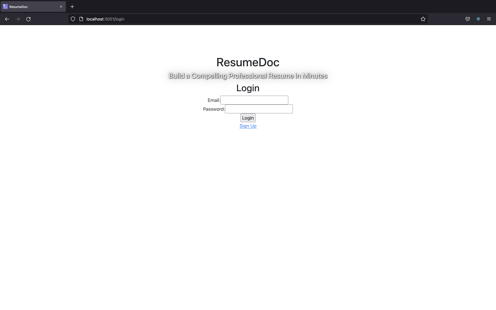
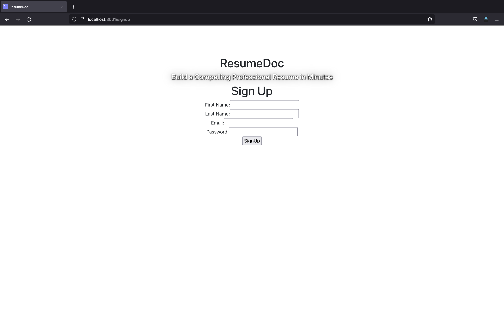
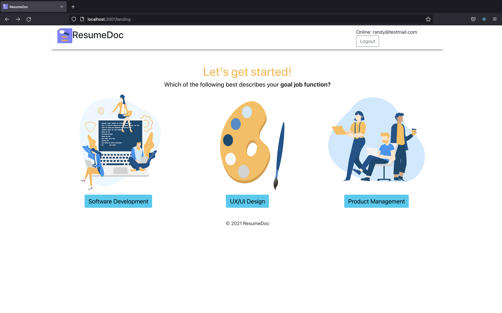
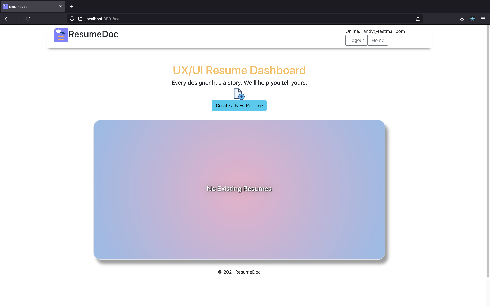
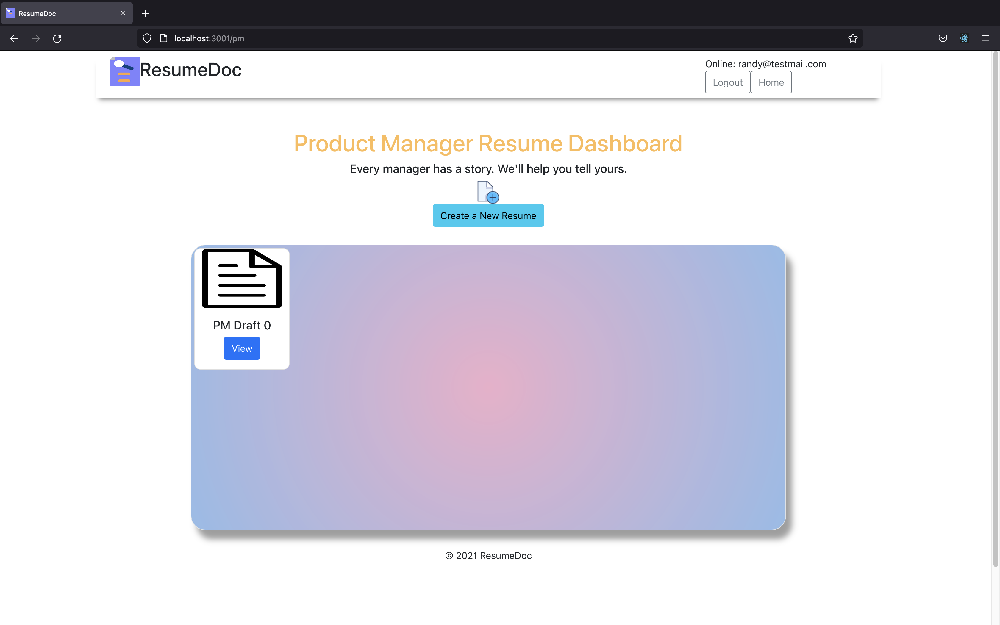
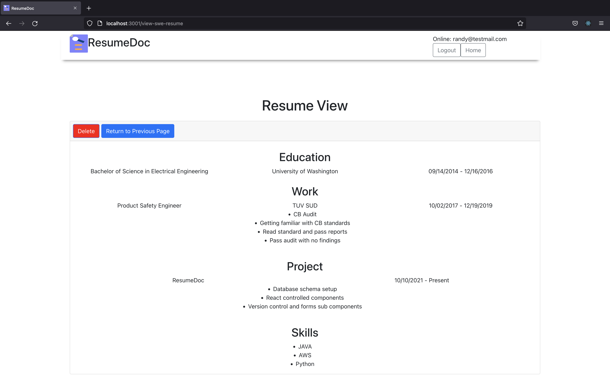
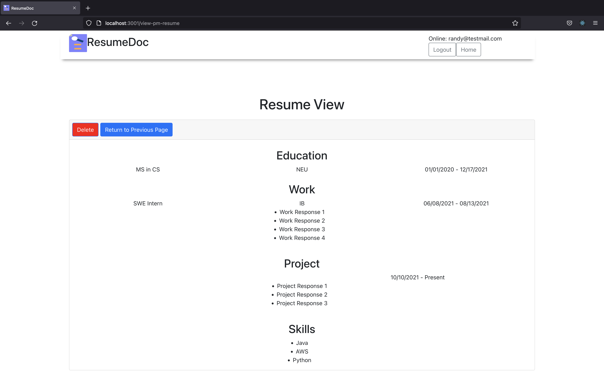
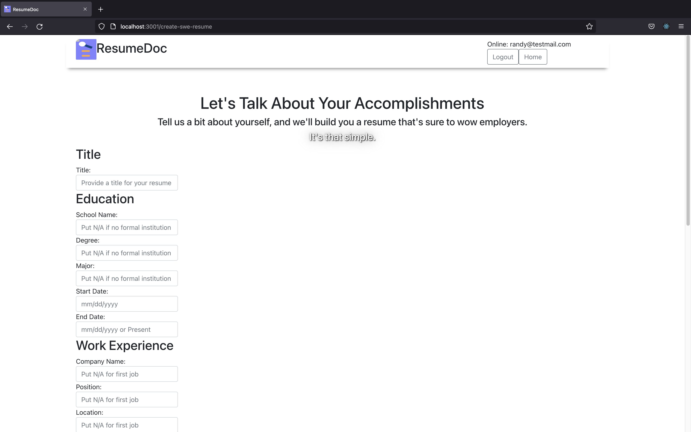
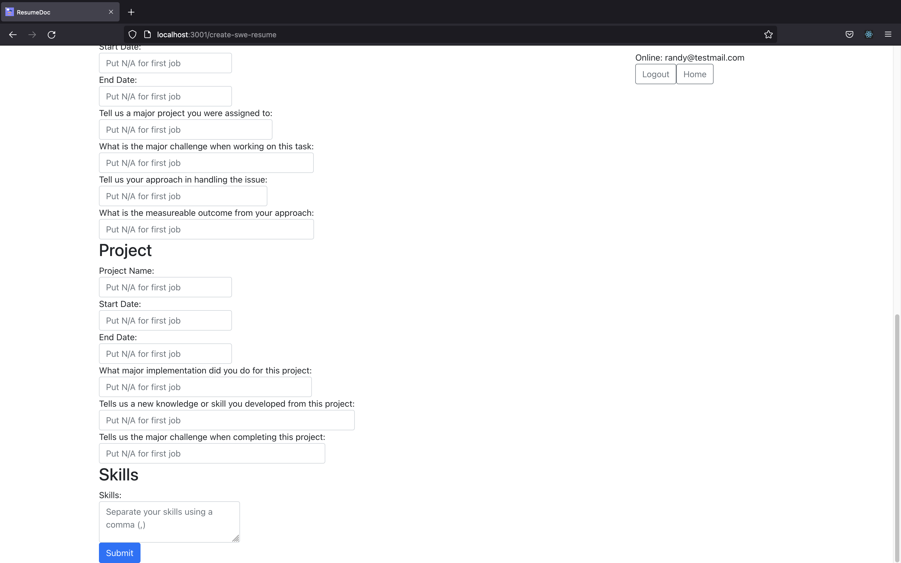

# ResumeDoc
A platform where students (both non-traditional and traditional alike) and folks looking to break into tech can create rich, compelling resumes in less than 10 minutes.


## Objective
This project is intended to focus on full-stack web development using React.js (frontend library), Node.js (backend development environment) and Express. The User Interface of this application was built using several modular React components. The database for the platform was built using a non-relational database called Mongo DB. The database was hosted using MongoDB Atlas as our database server.


## Screenshots
Below are the screenshots of the website
External Landing Page

Login Page:

Signup Page:

Internal Landing Page:

SWE Dashboard:

UX/UI Dashboard:

PM Dashboard:

SWE Resume View

PM Resume View

Create Resume 1 of 2

Create Resume 2 of 2



## How-To-Use
There are 2 ways to use this project.
1. Visit our deployed application at Heroku. (link below)
2. Clone this git repository and run locally.

### Using locally via `git clone`
Once you clone our repository, make sure to install all dependencies.
Run the following command inside ResumeDoc root folder to install all dependencies: `yarn install`

At the `db` folder, we have provided 4 JSON files to be used as a collection for the database.
1. UI_UX_Resumes.json
2. SWE_Resumes.json
3. PM_Resumes.json
4. Users.json

#### Creating local database
Before running the program we first need to create a local database.
Run the following command in your terminal to start local mongo server: `mongod --dbpath ~/data/db`
Keeping the local server running, open a new terminal and run the following to create local resumeDocDB database and import the given JSON files as collections:

1. Create local DB via command line
```
mongoimport -h localhost:27017 -d resumeDoc -c Users --drop --jsonArray --file ./db/Users.json
mongoimport -h localhost:27017 -d resumeDoc -c SWE_Resumes --drop --jsonArray --file ./db/SWE_Resumes.json
mongoimport -h localhost:27017 -d resumeDoc -c UI_UX_Resumes --drop --jsonArray --file ./db/UI_UX_Resumes.json
mongoimport -h localhost:27017 -d resumeDoc -c PM_Resumes --drop --jsonArray --file ./db/PM_Resumes.json
```

2. Create MongoDBCompass
If you have the MongoDBCompass GUI, you could also use that to import the given JSON file as collections

NOTE: In the db folder make sure the global constant is saying `DB_NAME = "resumeDoc"`, otherwise the program cannot find the local database.

#### Running locally
Once the local database has been created, follow these steps to run locally:
1. Open a terminal session and run Mongo server: `mongod --dbpath ~/data/db`
2. Install the `node_modules` folder in the backend at ~/resumeDoc with the command `yarn install`
3. Run the command `yarn start` to start the node backend server at port 3001
4. Open a new terminal session and install the `node_modules` folder in the frontend at ~/resumeDoc/frontend with the command `yarn install`
5. Run the command `yarn start` to start the react development sever at port 3000
6. Using your browser go to localhost: http://locahost:3000/ 

### Members
[Randy Lirano](https://randylirano.github.io/)
[Kennedy Ezumah](https://kezumah.github.io/index.html)

### Relevant Links
[Demo](https://resume-doc.herokuapp.com/)

[Videos and Usabiliity Reports](https://docs.google.com/document/d/1TCv87NgGT4yKoMJJWMCiX_lnK9k52CRk4S8aXHU1YJM/edit?usp=sharing)

[Slides](https://docs.google.com/presentation/d/1QqbB6q0ePhICMSK91DbACZfUMhQv2MGADNJeAO3ILAo/edit?usp=sharing)

[Class](https://johnguerra.co/classes/webDevelopment_fall_2021/)
